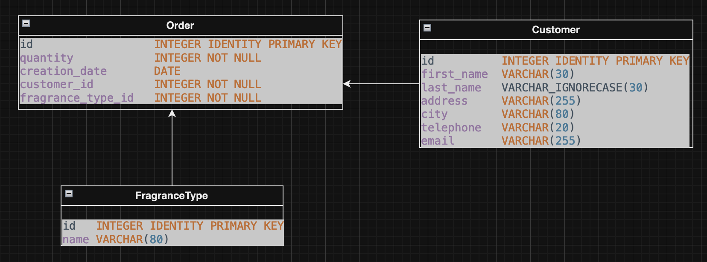

# Melior - Customer Transaction Management Sample REST Application
This is a backend Spring application, thus it only provides a REST API. **There is no UI**

## Melior Entity-relationship Model



## Run Melior Application locally
This project use Apache Maven and come with a Maven wrapper.
### With Maven wrapper in command line
```
git clone https://github.com/DThgTr/meliorapp.git
cd /meliorapp
./mvnw spring-boot:run
```
Alternatively, the project can be manually downloaded from its Github repository at https://github.com/DThgTr/meliorapp.
### OpenAPI REST Documentation
These are meant to be accessed after application start:
* The REST endpoints are documented with swagger UI. They are accessible at: 
[http://localhost:9966/melior/swagger-ui.html](http://localhost:9966/melior/swagger-ui.html).
* The Open API description is accessible at: [http://localhost:9966/melior/v3/api-docs](http://localhost:9966/melior/v3/api-docs).

### Database configuration
By default, Melior uses an in-memory database (HSQLDB) which gets populated at startup with data. 
Similar setup is provided for MySQL and PostgreSQL persistent database configurations. 
To run Melior Application using either MySQL or PostgreSQL, the profile configuration has to be changed accordingly:

1. **MySQL:** replace 'hsqldb' with 'mysql'
```
spring.profiles.active=hsqldb
```
defined in `application.properties`

MySQL configuration is defined in `application-mysql.properties`. It should be checked out a long side MySQL's `setup.sql` before setting up your own MySQL instance in case of any inconsistency.

2. **Postgres:** replace 'hsqldb' with 'postgres'
```
spring.profiles.active=hsqldb
```
defined in `application.properties`

Postgres configuration is defined `application-postgres.properties`. Likewise, it should be checked out before setting up your own PostgreSQL instance for any inconsistency.

Unlike MySQL configuration, the corresponding database (meliordb) has to be created beforehand. The name can be changed as long as it stay consistent with `application-postgres.properties`'s configuration.

3. **Set up Database:**

|As a local instance | As a Docker Container      |
|--------------------|----------------------------|
|[MySQL](https://dev.mysql.com/doc/mysql-getting-started/en/)<br/>[Postgres](https://www.postgresqltutorial.com/postgresql-getting-started/)| [MySQL](https://hub.docker.com/_/mysql)<br/>[Postgres](https://hub.docker.com/_/postgres) |

## Build Melior Application
### Generated Content
There are required classes generated during build process:
* DTO Mappers
* DTOs
* API template interfaces.

All of these classes are generated in the `target/generated-sources` folder.

Generated packages and their corresponding tools:

| Package name                | Tool             |
|-----------------------------|------------------|
| com.sample.meliorapp.Mapper | [MapStruct](https://mapstruct.org/)        |
| com.sample.meliorapp.rest   | [OpenAPI Generator maven plugin](https://github.com/OpenAPITools/openapi-generator/) |
### Generate code with Maven
Use the following command to generate them using the Maven wrapper:
* Build and Test:
```
./mvnw clean install
```
* Build only:
```
./mvnw clean install -DskipTests=true
```
If you have Maven installed on your machine, you can use its associated command ```mvn``` instead of the wrapper ```./mvnw```